# 🍔 Food Delivery Customer & Merchant Analysis

## Business Problem
Bagaimana platform food delivery dapat menggunakan data transaksi untuk meningkatkan customer engagement, merchant performance, campaign timing, dan delivery experience?

## Dataset
- **Source**: [Kaggle - Food Delivery Order History Data](https://www.kaggle.com/datasets/sujalsuthar/food-delivery-order-history-data)
- **Size**: 21.321 order, 29 kolom, 6 restoran, 8 subzone (Delhi NCR)
- **Target**: `high_value_order` (bill_subtotal ≥ median)

## Tools & Technologies
Python · Pandas · NumPy · Seaborn · Matplotlib · Scikit-learn · Tableau

## Links
- 📓 [Kaggle Notebook](https://www.kaggle.com/code/zx1700/da03-food-delivery)
- 📊 [Tableau Interactive Dashboard](https://public.tableau.com/views/FoodDeliveryCustomerMerchantAnalysis/Dashboard1?:language=en-US&:sid=&:redirect=auth&:display_count=n&:origin=viz_share_link)

---

## Dashboard Tableau

## Tableau Dashboard

## Analysis & Results

### 1. Data Overview
- **21.321 order** dari 6 restoran di 8 subzone, semua di Delhi NCR
- **11.607** customer unik
- Missing value tinggi pada kolom opsional: Rating (88.3% kosong), Review (98.6% kosong) — wajar karena tidak semua customer memberikan rating
- **0 duplikasi** data

### 2. Distribusi Order Value

| Metrik | Nilai |
|---|---|
| Rata-rata | **₹750** |
| Median | **₹629** |
| Min | ₹50 |
| Max | ₹16.080 |

Distribusi **right-skewed** — mayoritas order bernilai menengah-rendah.

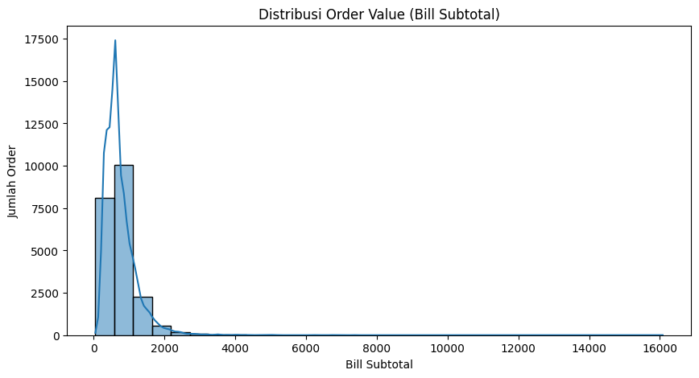

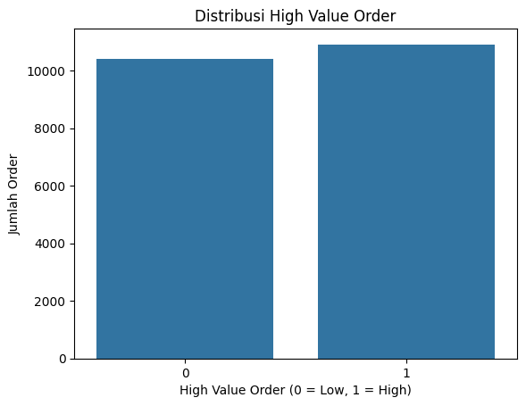

### 3. Analisis Area (Subzone)

> Kolom `city` hanya berisi 1 nilai (Delhi NCR) sehingga analisis dilakukan per **subzone**.

**Greater Kailash 2 (GK2)** memiliki jumlah order dan revenue terbanyak dari 8 subzone.

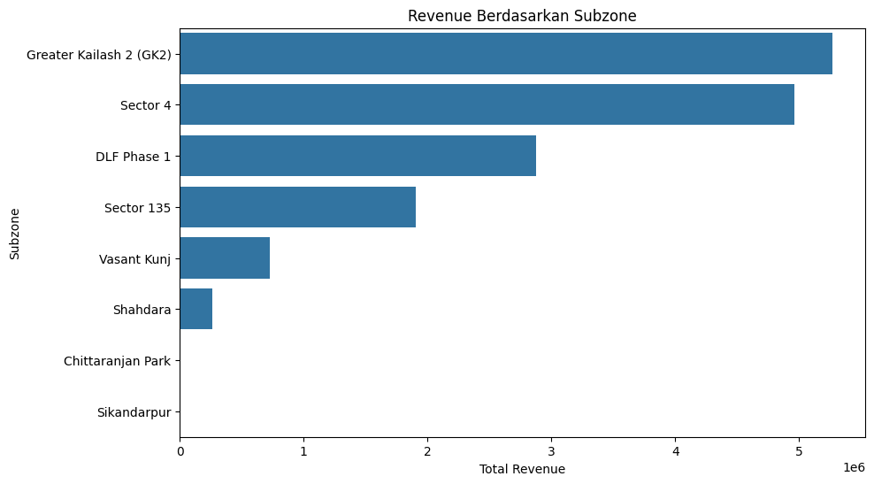

### 4. Analisis Restoran

**Aura Pizzas mendominasi** dengan **14.548 order (68.2%)** — revenue driver utama, namun juga risiko ketergantungan.

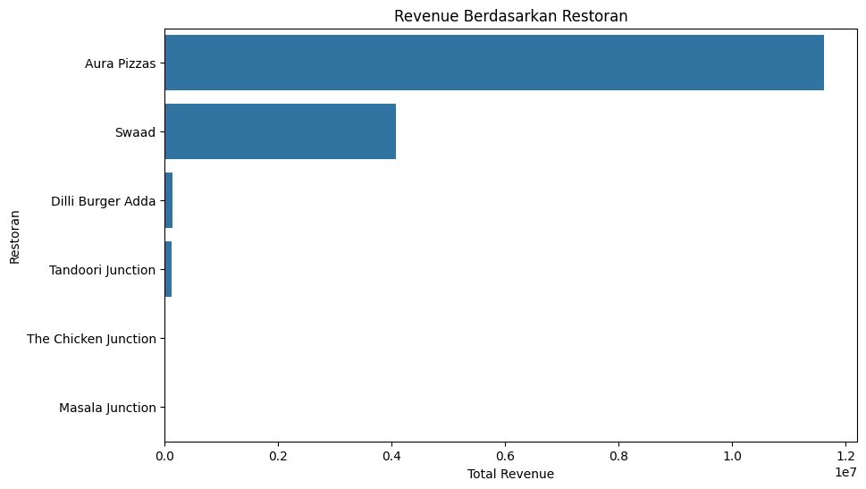

### 5. Analisis Waktu Puncak Order

Pola order berdasarkan jam dan hari menunjukkan peak hours untuk timing campaign dan alokasi rider.

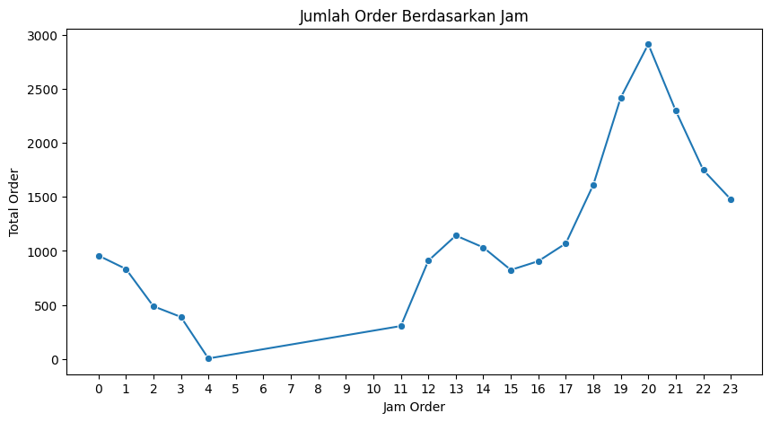

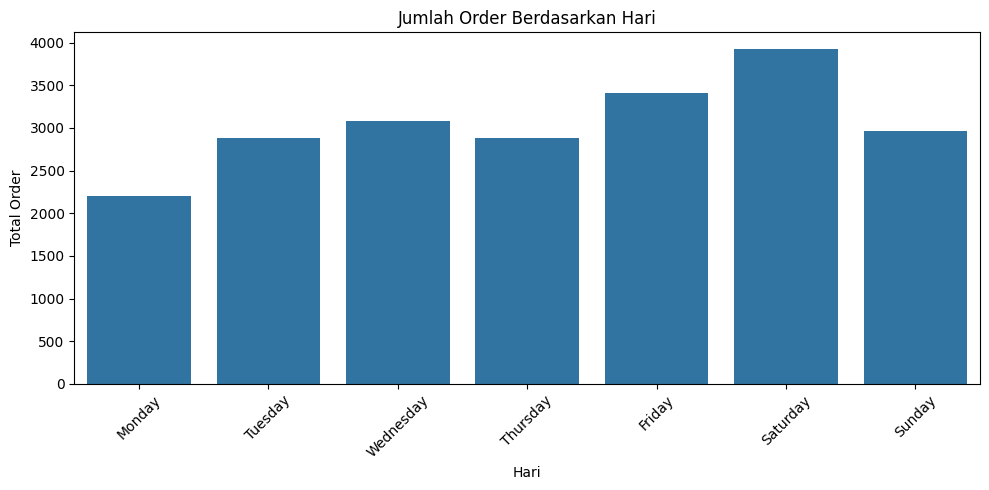

### 6. Analisis Promo / Discount

Perbandingan order value antara order **dengan diskon** vs **tanpa diskon**.

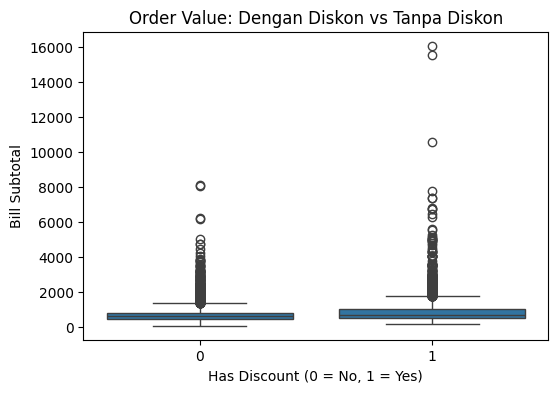

### 7. Correlation Heatmap

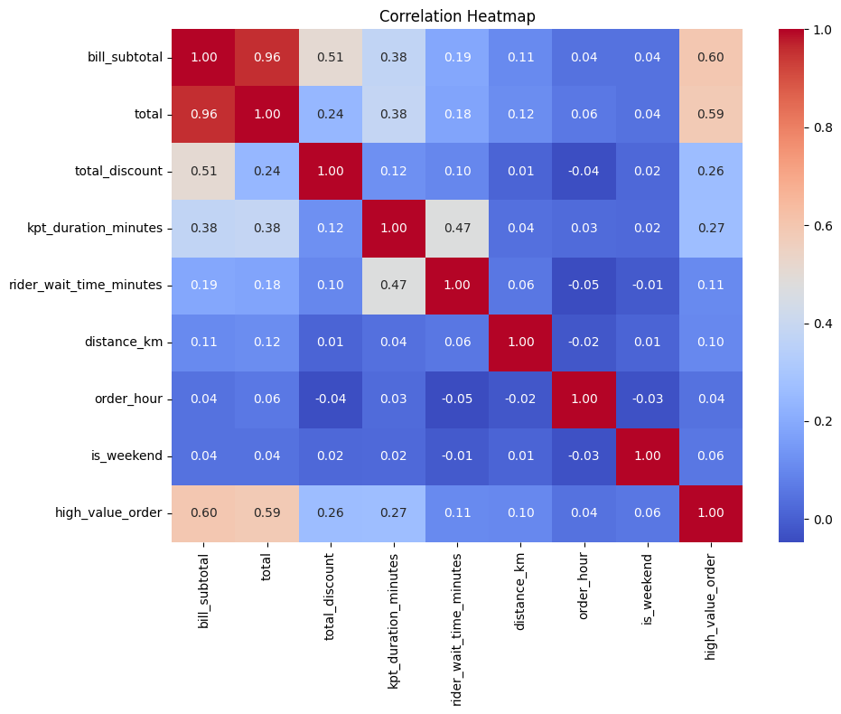

### 8. Audio Features vs High Value Order

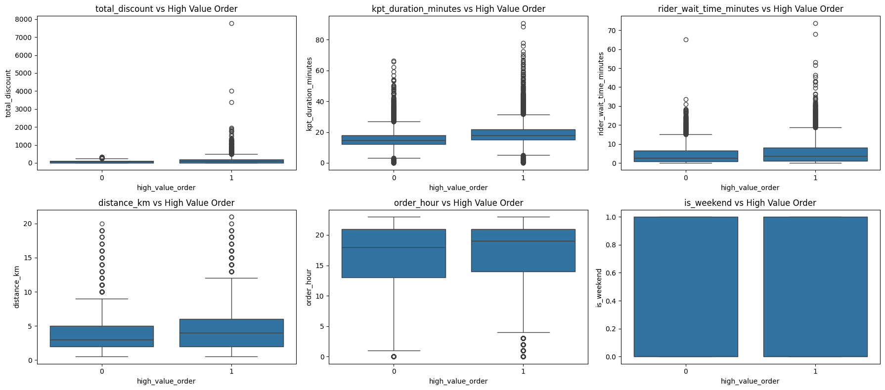

### 9. Feature Importance

#### Logistic Regression
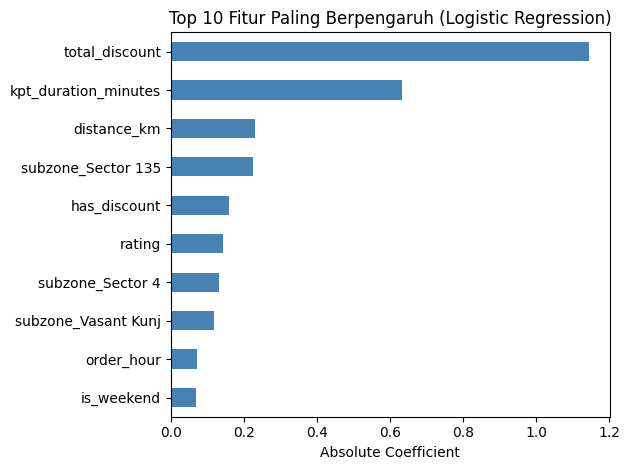

#### Random Forest
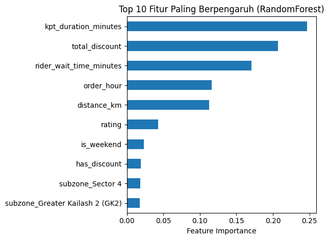

#### XGBoost
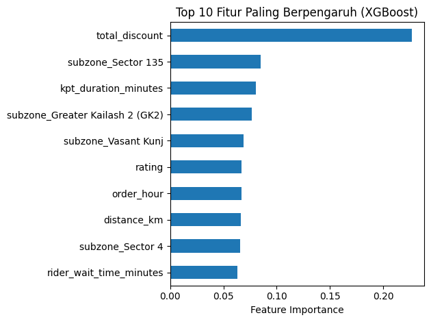

---

## Key Findings
1. Rata-rata order value **₹750**, median **₹629** (right-skewed)
2. **Aura Pizzas** mendominasi 68.2% total order — ketergantungan tinggi pada 1 merchant
3. **Greater Kailash 2** = subzone dengan order terbanyak
4. KPT rata-rata **17 menit**, rider wait **~5 menit**
5. Hanya **11.7%** customer yang memberikan rating (rata-rata 4.36)
6. `total_discount`, `distance_km`, `kpt_duration` = faktor utama high value order

## Recommendations
- **Product**: Optimalkan discovery untuk restoran selain Aura Pizzas agar revenue lebih terdiversifikasi
- **Merchant**: Prioritaskan restoran dengan rating tinggi dan order stabil untuk program partnership
- **Marketing**: Jalankan campaign pada jam/hari puncak order, evaluasi efektivitas promo
- **Operations**: Pantau restoran dengan KPT tinggi, optimalisasi alokasi rider di GK2

---

*Project ini merupakan bagian dari portfolio Data Analyst.*
